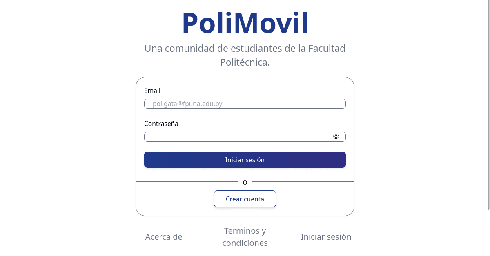

# PoliMovil

## Tabla de contenidos

- [Descripción general](#descripción-general)
  - [Screenshot](#screenshot)
  - [Links](#links)
- [Instrucciones de instalación](#instrucciones-de-instalación)
- [Creado con](#creado-con)
- [Desarrollo continuo](#desarrollo-continuo)
- [Recursos útiles](#recursos-útiles)
- [Contacto y soporte](#contacto-y-soporte)

## Descripción general

Proyecto de codigo abierto que busca brindar una alternativa de transporte solidario a los estudiantes de la Facultad Politécnica de la Universidad Nacional de Asunción.

### Screenshot

  

    
  

### Links

- Repository URL: [https://github.com/Guille-Sanchez/poliMovil](https://github.com/Guille-Sanchez/poliMovil)
- PoliMovil site URL: [https://polimovil.netlify.app/](https://polimovil.netlify.app/)

## Instrucciones de instalación

### Clona el repositorio:
Inicia clonando el repositorio del monorepo.

### Configuración del entorno:

- Asegúrate de tener Node.js y npm instalados en tu sistema.
- Configura MongoDB Atlas y asegúrate de tener una instancia de MongoDB en funcionamiento siguiendo el ejemplo del archivo .env.example de la carpeta server.

#### Backend (servidor):

- Navega hasta la carpeta del server en el repositorio clonado.
- Ejecuta `npm install` para instalar las dependencias del servidor.
- Crea un archivo .env en la carpeta del servidor y configura las variables de entorno necesarias, como la cadena de conexión de MongoDB.
- Ejecuta `npm run dev` para iniciar el servidor. Debería estar escuchando en un puerto específico, por ejemplo, el puerto 3000.

####  Frontend (cliente):

- Navega hasta la carpeta del client en el repositorio clonado.
- Ejecuta `npm install` para instalar las dependencias del cliente.
- Crea un archivo .env en la carpeta del cliente y configura las variables de entorno necesarias, como la URL del servidor backend.
- Ejecuta `npm run dev` para iniciar la aplicación cliente. Se abrirá en tu navegador por defecto en un puerto específico, como el puerto 5173.

### Creado con

#### Backend (servidor):

- MongoDB
- Express.js
- Node.js

####  Frontend (cliente):
- Vite
- [React](https://reactjs.org/) - JS library
- TypeScript
- TailwindCSS

### Desarrollo continuo

- Backend (servidor):

En el futuro, se realizarán trabajos para la autenticación de los correos académicos mediante la implementación de Nodemailer u otro servicio similar. Se reestructurará la base de datos, incluyendo la paginación, para mejorar el rendimiento de la aplicación. Además, se añadirá una conexión con un servicio como Firebase para el almacenamiento de archivos multimedia y permitir a los usuarios tener imágenes, entre otras mejoras.

- Frontend (cliente):

En el futuro, se realizarán trabajos como la provisión de errores personalizados a los usuarios y la implementación del scroll infinito en las publicaciones. También se renderizarán elementos críticos y se permitirá a los usuarios con el atributo isAdmin eliminar publicaciones de otros usuarios, entre otras funcionalidades.

### Recursos útiles

- [React Icons](https://reactsvgicons.com/) - Recurso para la provisión de iconos.

## Contacto y soporte

- LinkedIn - [Guillermo Sanchez](https://www.linkedin.com/in/guillermo-sanchez-developer/)
